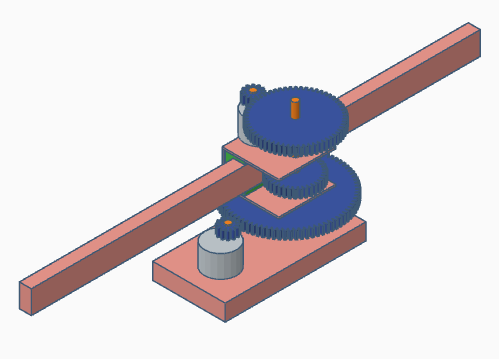
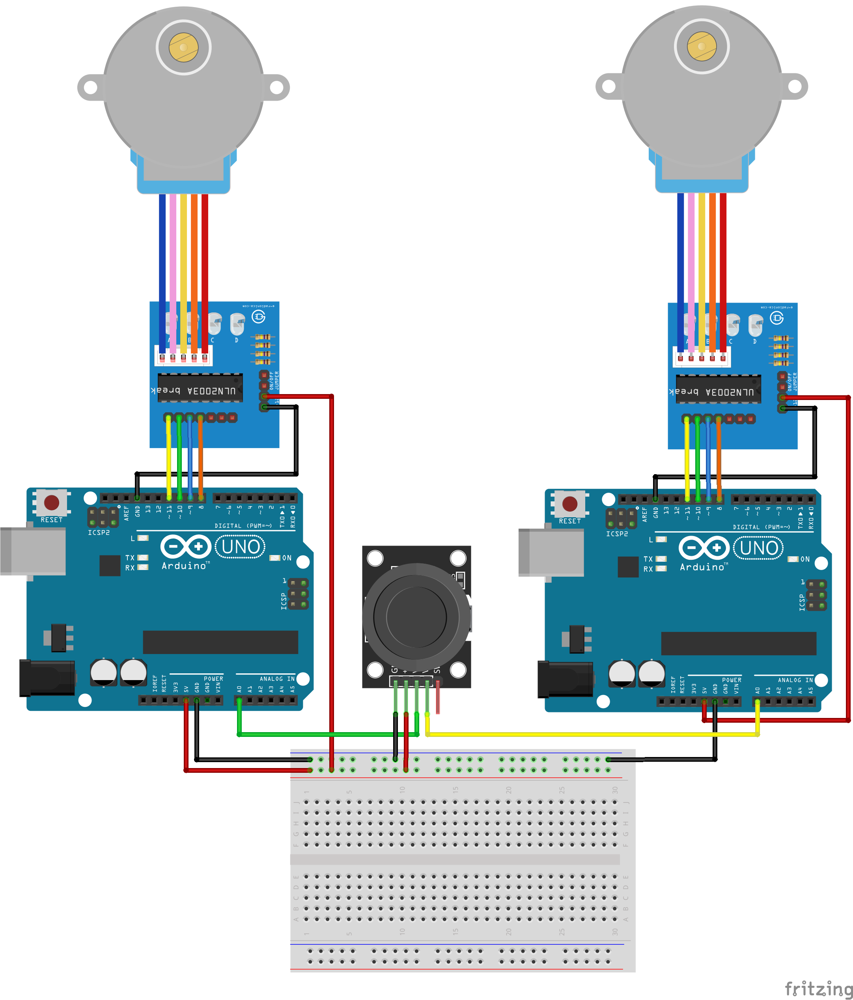

# Lokaverkefni (20%)
_Í vinnslu_

## Verkefnalýsing

### Tannhjól og línuleg hreyfing

Í þessu verkefni ætlar þið að setja saman mekaník með snúnings- og línulegri hreyfingu sem Arduino stýrir mótorum. Verkefnið er unnið í tveggja eða þriggja manna hópum.

### Dæmi um útfærslu

### Rafrásarteikning

### Íhlutir

- 2 tannhjól, 12 tennur
- 1 tannhjól, 86 tennur
- 1 tannhjól, 60 tennur
- 1 tannhjól, 36 tennur
- 2 Arduino
- 2 Stepper mótorar
- 2 Stepper mótor controler
- Stýripinni
- Brauðbretti
- Vírar

### Kóði

Kemur síðar

## Námsmat
_Í vinnslu_
<!--
- Samsetning á mekaník (40%)
- Tenging á mótorstýringum (40%)
- Virkni (20%)
-->

## Skil verkefnisins

Haltu utan um allt sem tengist verkefninu á github svæðinu sem þú átt fyrir áfangann.

Þar á að vera:

- Ljósmynd af mekaník.
- Ljósmynd sem sýnir tengingar.
- Myndband sem sýnir virkni verkefnisins (munið að láta nöfnin ykkar og dagsetningu koma fram í myndbandinu).
